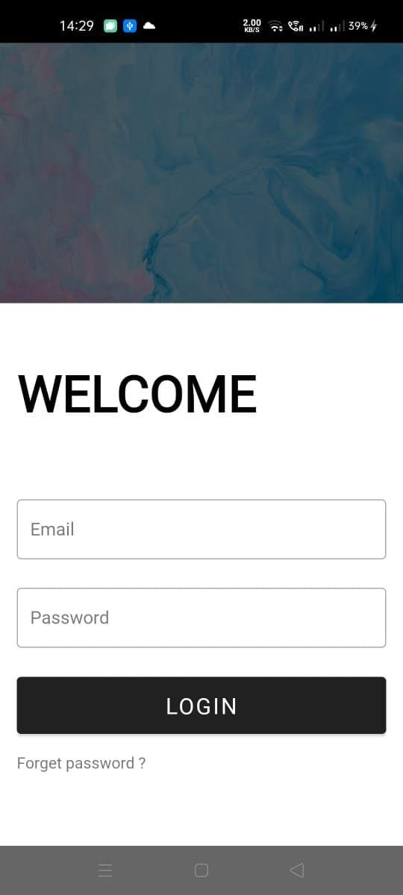
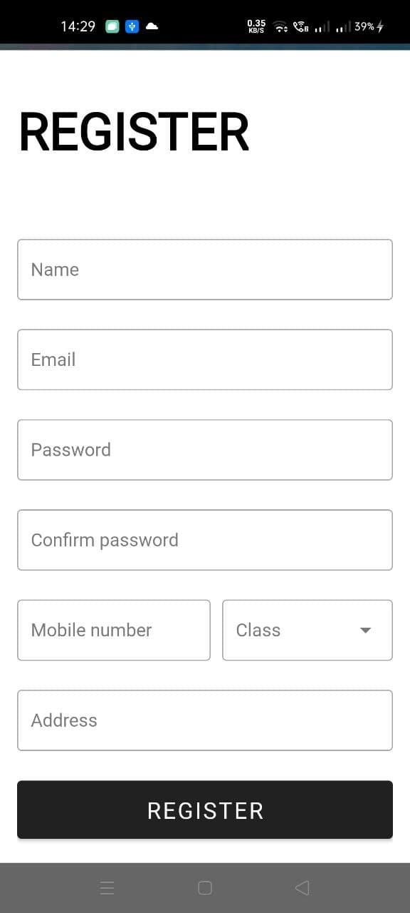
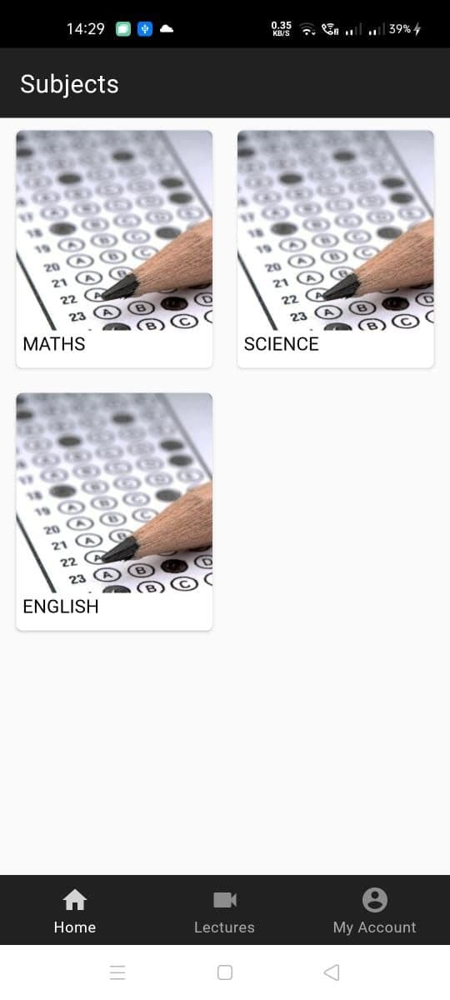
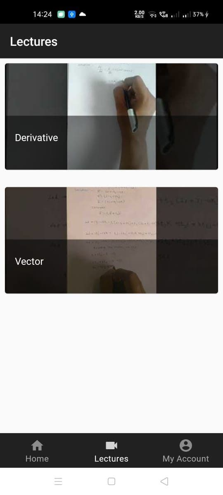
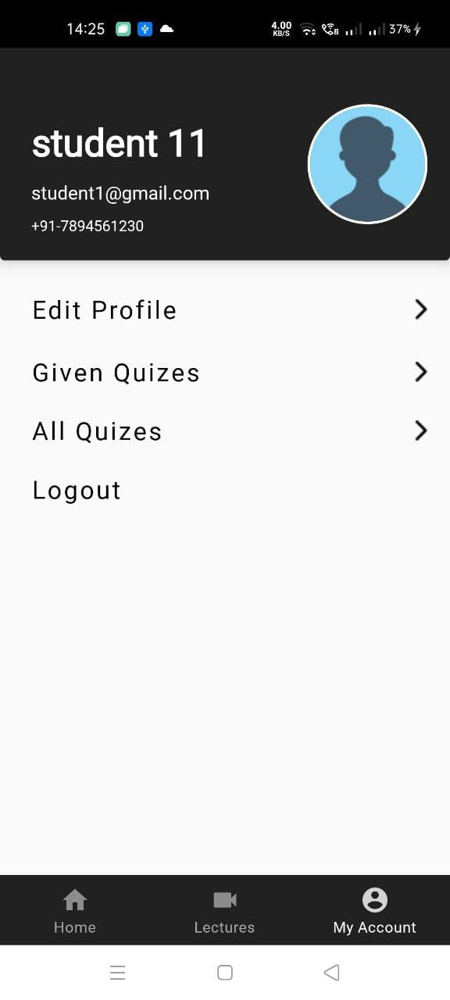
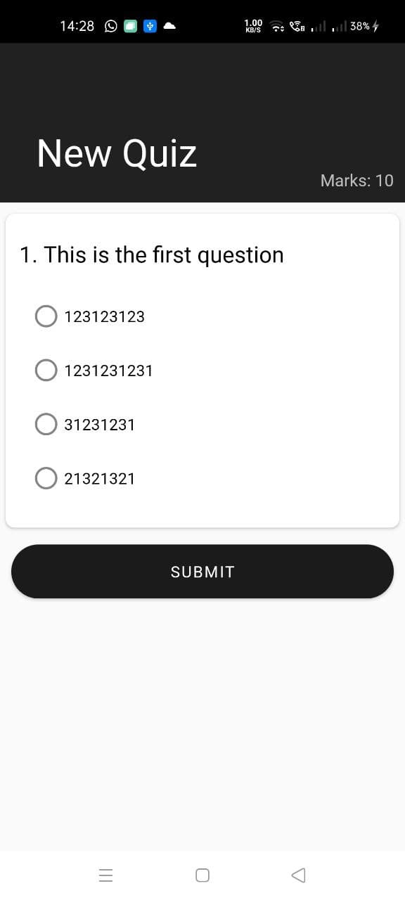
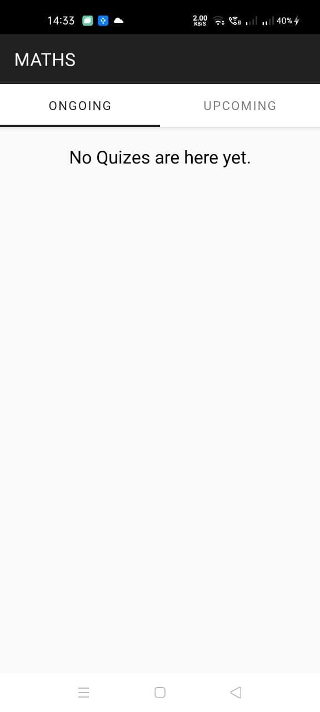
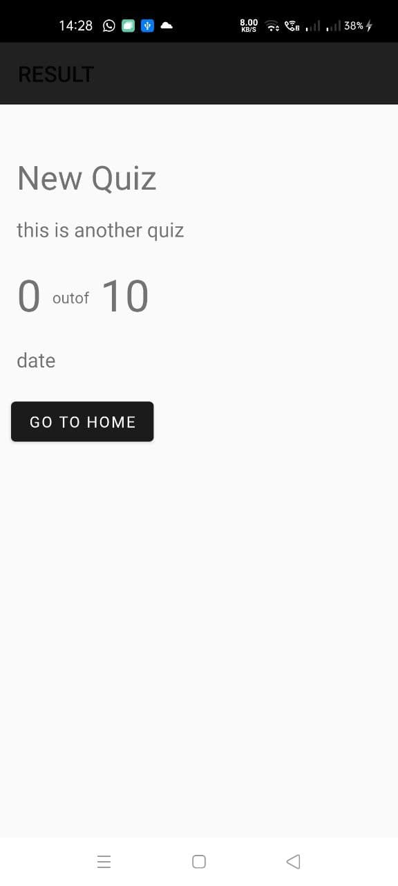

# QuizApp

# Android Client for PocketTest

## Checkout Pocket Test Server [here](https://github.com/vikS7/PocketTestServer)

## Screenshots

# Libraries used

- [Material Design:1.2.1](https://github.com/material-components/material-components-android)
- [Volley:1.1.0](https://github.com/google/volley)
- [Picasso:2.71](https://github.com/square/picasso)
- [Skeleton Layout:2.10](https://github.com/Faltenreich/SkeletonLayout)
- [Circle Image View:3.1.0](https://github.com/hdodenhof/CircleImageView)

